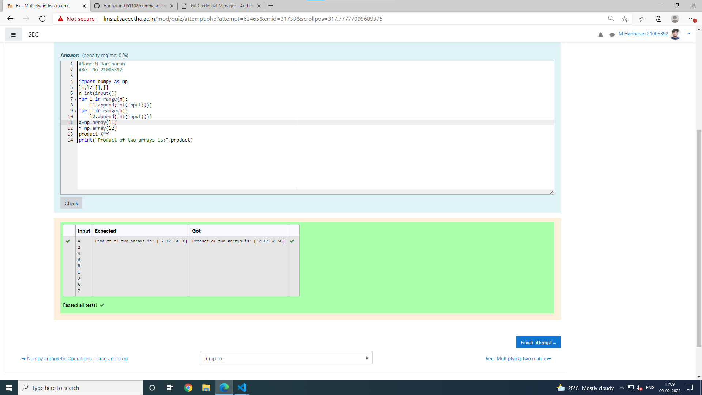

# Multiplying-two-matrix

## AIM:

## ALGORITHM:

### Step 1:
### Step 2:
### Step 3:
### Step 4:
### Step 5:

## PROGRAM: 
~~~
#Name:M.Hariharan
#Ref.No:21005392
import numpy as np
l1,l2=[],[]
n=int(input())
for i in range(n):
    l1.append(int(input()))
for i in range(n):
    l2.append(int(input()))
X=np.array(l1)
Y=np.array(l2)
product=X*Y
print("Product of two arrays is:",product)
~~~

## OUTPUT:

## RESULT:

